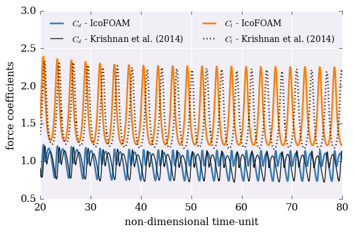
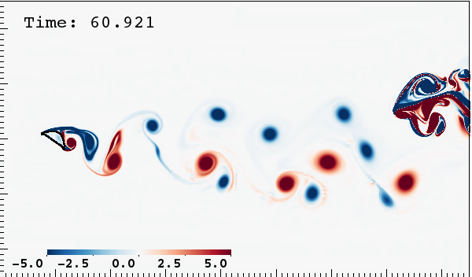

    $ git log --oneline origin/master..HEAD MesnardBarba-CiSE.md

     MesnardBarba-CiSE.md | 81 ++++++++++++++++++++++++++--------------------------
     1 file changed, 41 insertions(+), 40 deletions(-)
    

<code>MesnardBarba-CiSE.md</code>

    

    index 591c8bc..363c729 100644
    --- a/MesnardBarba-CiSE.md
    +++ b/MesnardBarba-CiSE.md

<code>@@ -5,11 +5,11 @@</code>

Our research group prides itself for having adopted Reproducible Research practices. 
Barba made a public pledge titled *"Reproducibility PI Manifesto"* ^(1) (PI: Principal Investigator), which at the core is a promise to make all research materials and methods open access and discoverable: releasing code, data and analysis/visualization scripts.

In 2014, we <ins class="ins">(this "we" might suggest that Mesnard and Barba published the paper?)</ins> published a study on Physics of Fluids titled *"Lift and wakes of flying snakes."* ^(2) 
It is a study that uses our in-house code for solving the equations of fluid motion in two dimensions (2D), with a solution approach called <ins class="ins">the</ins> “immersed boundary method.” 
The key of such a method for solving the equations is that it exchanges complexity in the mesh generation step for complexity in the application of boundary conditions. 
It makes <ins class="ins">it</ins> possible <del class="del">using</del><ins class="ins">to use</ins> a simple discretization mesh (structured Cartesian), but at the cost of an elaborate process that interpolates values of fluid velocity at the boundary points to ensure the no-slip boundary condition (that fluid sticks to a wall). 
The main finding of our study on wakes of flying snakes was that <del class="del">the</del><ins class="ins">a</ins> 2D section with anatomically correct geometry for the snake’s body experiences lift enhancement at a given angle of attack.
A previous experimental study had already shown that the lift coefficient of a snake cross section in a wind tunnel gets an extra oomph of lift at 35 degrees angle-of-attack. 
Our simulations showed the same feature in the plot of lift coefficient.^(3) 
Many detailed observations of the wake (visualized from the fluid-flow solution in terms of the vorticity field in space and time) allowed us to give an explanation of the mechanism providing extra lift.

<code>@@ -98,7 +98,7 @@</code>

Figure 3:
Time-averaged drag (top) <ins class="ins">and</ins> lift (bottom) coefficients as function of the snake's angle-of-attack for Reynolds numbers 1000 and 2000.
We averaged all IcoFOAM force coefficients between 32 and 64 time-units of flow-simulation as we have done in our previous study.

<code>@@ -118,26 +118,27 @@</code>

The numerical approach in IBAMR belongs to the same family as that used in our published work on wakes of flying snakes: an immersed boundary method. 
The essence of the approach is that the fluid is represented by a fixed structured mesh, while the immersed body is represented by its own, separate mesh that moves with the body. 
<del class="del">We speak of</del><ins class="ins">(word choice)</ins> an Eulerian mesh for the fluid, and a Lagrangian mesh for the solid. 
The forces exerted by the fluid on the body, and vice versa, appear as an additional integral equation and interpolation schemes between the two meshes. 
<ins class="ins">(The forces don't appear as interpolation schemes, rather the interpolation schemes are used to compute the forces)</ins>
The role of these <ins class="ins">(unclear antecedent - these == "forces" or these == "additional integral eq and interpolation scheme")</ins> is to make the fluid "stick" to the wall (no-slip boundary condition) and allow the body to feel aerodynamic forces (lift and drag).
Our cuIBM code uses a variant called the immersed boundary projection method,^(4) while IBAMR uses a form called the "direct-forcing" method. 
Despite the variations, the <del class="del">essence is</del><ins class="ins">two are essentially</ins> the same, and it is reasonable to assume they would work similarly.

We already know that boundary conditions at the outlet of the computational domain can be problematic. This is no different with immersed boundary methods. 
Our first attempt with IBAMR used a zero-gradient velocity boundary condition at the outlet. 
This <del class="del">resulted</del><ins class="ins">results</ins> in <del class="del">some</del><ins class="ins">a(?)</ins> blockage effect when the wake vortices reach the domain boundary: strong vorticity rebounds from the artificial boundary and propagates back to the domain (Figure 5). 
Of course, this is unphysical and the result <ins class="ins">is</ins> unacceptable. 
After a long search in the literature and in the code documentation, we discovered that IBAMR <del class="del">needs us to select</del><ins class="ins">requires the selection of</ins> a "stabilized outlet," which is a boundary condition that acts like a force pushing the vortices <del class="del">out.</del><ins class="ins">out of the domain.</ins> 
(IBAMR does not provide a convective/advective boundary condition.) 
With this new configuration, the simulations of the snake profile resulted in a wake that looked physical, but a computed lift coefficient that was considerably different from our published study (Figure 6). 
Another deep dive in the literature led us to notice that a benchmark example <del class="del">described</del><ins class="ins">defined</ins> in a paper describing extensions to IBAMR^(5) was set up in an unexpected way: 
the no-slip condition is forced _inside_ the body, and not just on the boundary. 
As far as we <del class="del">could</del><ins class="ins">can(?)</ins> find, the publications using IBAMR are the only cases where interior points are constrained. 
Other papers using immersed boundary methods apply the constraint only on boundary points.
When we followed their example, our simulations with IBAMR were able to reproduce the lift enhancement at <del class="del">35 degrees angle-of-attack,</del><ins class="ins">angle-of-attack 35° (if consistent with previous formatting),</ins> although with a slightly different value of average lift (<5% off). 
The successful result comes with a caveat, though. 
If we look at the time signature of the lift and drag coefficients, there is excellent agreement with our previous results for<del class="del">30 degrees</del> angle-of-attack <ins class="ins">30°</ins> (Re=2000). 
But at 35 degrees, the time signatures drift apart after about 40 time units (more than 150 thousand time steps). 
There is a marked drop in the (time varying) lift coefficient (Figure 7(b)), but because the average is calculated over a time range between 32 and 64 time units (a reasonable but arbitrary choice), the final numeric result is not far off our published study. 
Like in the previous case, using OpenFOAM, we make a judgement call that this result does indeed pass muster as a replication of our previous study. 

<code>@@ -148,7 +149,7 @@</code>

The published record is incomplete in this regard: we could find no explanation for it in any paper using IBAMR. 
One of the issues may be that our community does not have a habit of communicating negative results, nor of publishing papers about software. 
We learned from this experience that using an open research code and getting correct results with it could involve a long investigative period, potentially requiring communication with the original authors and many failed attempts. 
If the code is not well documented and the original authors not responsive to questions, then building your own code from scratch could be more sensible! <ins class="ins">(Maybe a note here, or a distinction, between building from scratch writing own MPI etc. vs. writing a solver based on something robust and tested like PETSc?)</ins>

<code>@@ -180,7 +181,7 @@</code>

We rely on external libraries to solve sparse linear systems of equations: _Cusp_ for GPU devices and PETSc for distributed CPU systems. 
It turns out, the iterative solvers may have differences that affect the final solution.

When repeating our previous simulations of the aerodynamics of a snake cross-section with PetIBM, the solutions do not always match those <ins class="ins">computer</ins> with cuIBM. 
At a Reynolds number of 1000, both the time-averaged lift and drag coefficients match. 
But at Reynolds equal to 2000, average lift and drag match up to 30 degrees angle-of-attack, but not at 35 degrees. 
That means that we don't see lift enhancement (Figure 8) and the main finding of our previous study is not fully replicated. 

<code>@@ -188,25 +189,25 @@</code>

What is different in the two codes? 
Apart from using different linear algebra libraries, they run on different hardware. 
Leaving hardware aside for now, let's focus on the iterative solvers. 
Both _Cusp_ and PETSc use the same convergence criterion.  <ins class="ins">(Huh? Maybe this should be posed as a question?)</ins>
This is not always the case, and needs to be checked! 
We're also not using the same iterative solver with each library. 
The cuIBM runs (with _Cusp_) used an algebraic multigrid preconditioner and conjugate gradient (CG) solver for the <del class="del">pressure modified-Poisson</del><ins class="ins">modified pressure-Poisson</ins> equation. 
With PETSc, the CG solver resulted in an error message with "indefinite preconditioner," and we had to select a different method: we used biCGstab <del class="del">(with</del><ins class="ins">(while</ins> still <ins class="ins">using</ins> an algebraic multigrid preconditioner). 

Could this difference in linear solvers affect our unsteady fluid-flow solution? 
The solutions with both codes match at lower angles of attack (and lower Reynolds numbers), so what is going on? 
We checked everything two, three <ins class="ins">(this reads as "two, maybe three... we can't remember")</ins> times. 
In the process, we did find some small discrepancies. 
Even a small bug (or two).
We found, for example, that the first set of runs with PetIBM created a slightly different problem set-up, compared with our previous study, where the body was shifted by less than one grid-cell width. 
Rotating the body to achieve different angles of attack was made around a different center, in each case (one used grid origin at <del class="del">0,0</del><ins class="ins">(0,0)</ins> while the other used the body center of mass). 
This tiny difference does result in a different average lift coefficient (bottom graph in Figure 9)! 
The time signal of lift coefficient shows that the drop we were <del class="del">seing</del><ins class="ins">seeing</ins> at around 35 time units now occurs closer to 50 time units, resulting in a different value for the average taken in a range between 32 and 64. 
Again, this range for computing the average is a choice we made. 
It covers about ten vortex shedding cycles, which seems enough to calculate the average if the flow is periodic.
What is causing the drop <del class="del">of</del><ins class="ins">in</ins> lift? 
Visualizations of the wake vortices (Figure 10) show that a vortex-merging event <del class="del">occurred</del><ins class="ins">occurs</ins> in the middle of the wake, changing the near-wake pattern. 
The previously aligned positive and negative vortices are replaced by a wider wake with a single clockwise vortex on the top side and a vortex dipole on the bottom part. 
With the change in wake pattern comes a drop in the lift force. 

<code>@@ -214,14 +215,14 @@</code>

Although PetIBM implements the same immersed-boundary method and was developed by the same research group, we were not able to fully replicate the previous findings. 
The aerodynamic lift on a snake section at 35 degrees angle-of-attack is a consequence of the near-wake vortices providing extra suction on the upper side of the body. 
When a vortex merger event changes the wake pattern, lift drops. 
Vortex merging is a fundamentally two-dimensional instability, so we<del class="del">may</del> expect that this problem won't trouble us in more realistic 3D simulations. 
But it is surprising that small changes---within the bounds of truncation error, roundoff error and algebraic errors---can trigger this instability, changing the flow appreciably. 
Even when the only difference between two equivalent simulations is the linear algebra library used, there can be challenges to reproducibility.

Figure 8:
Time-averaged drag (top) and lift (bottom) coefficients as function of the snake's angle-of-attack and for Reynolds numbers 1000 and 2000 using the same Eulerian mesh <del class="del">than the one in</del><ins class="ins">as</ins> our past cuIBM simulations.
We show PetIBM results obtained when the immersed-boundary is rotated around: (1) its center of mass (green and orange symbols) and (2) the reference origin (solo red marker).

<code>@@ -230,7 +231,7 @@</code>

Figure 9: 
Instantaneous force coefficients for the snake's section with angle-of-attack 35° and Reynolds number 2000.
The figure on top compares the PetIBM results with those reported in our previous study.
The second figure compares results with the immersed-boundary being rotated around its center of mass (slightly shifted <del class="del">than in</del><ins class="ins">compared to</ins> our previous study) and around the reference origin (identical set of markers <del class="del">than in</del><ins class="ins">to</ins> our previous study).

<code>@@ -252,12 +253,12 @@</code>

As we mentioned in the opening of this article, we adopted a set of practices years ago to make our research reproducible. 
The study published as "Lift and wakes of flying snakes" was completed under the guidance of the "Reproducibility PI Manifesto," 
which includes: 
(1)<del class="del">the</del> code<del class="del">was</del> developed under version control; 
(2)<del class="del">we</del> completed validation and verification,<del class="del">publishing the</del> report <ins class="ins">published</ins> on Figshare; 
(3)<del class="del">the</del> data and figures for the main results of the paper are open; 
(4)<del class="del">the</del> pre-print is available on arXiv; 
(5)<del class="del">the</del> code<del class="del">was</del> released under MIT License; 
(6) <del class="del">we included</del><ins class="ins">include</ins> a Reproducibility statement in the paper. 
Of course we expect to be able to reproduce our own results!

The first hurdle we faced is that, three years after we completed our previous study, we have updated our lab computers: 

<code>@@ -271,14 +272,14 @@</code>

The case at angle-of-attack 35 degrees and Reynolds number 2000 now gave an appreciable difference compared with our previous study: 
the instantaneous force coefficients start to slowly drop after about 60 time units (Figure 11(c)). 
Now, this is _really_ the same code, with only a difference in the _version_ of the linear algebra library. 
Repeating the case with the most current version of cuIBM and the same version of _Cusp_ (0.4.0) leads to the same force <ins class="ins">(the same as which?)</ins> signals, with a slight drop towards the end (Figure 11(d)). 
And the same is the case with the current version of cuIBM and a later version of _Cusp_ (0.5.1). 
The final _findings_ in these cases do not vary from our published work: there is, in fact, lift enhancement at 35 degrees angle-of-attack ... but the results match only because we calculate the average lift in a time interval between 32 and 64. 
Yet, the flow solution was affected by changing the version of a dependent library. 
(The revision history of _Cusp_ says that they refactored the smooth-aggregation solver between the two versions we are using.) 
The hardware was also different (a K20 GPU versus a C2070 in our older study), and the operating system, and the compiler. 
In an iterative linear solver, any of these things could be related to lack of floating-point reproducibility. 
And in unsteady fluid dynamics, small floating-point differences can add <ins class="ins">up</ins> over thousands of time steps to eventually trigger a flow instability (like vortex merging).

**Postmortem**. 
Making research codes open-source is not enough for reproducibility: we must be meticulous in documenting every dependency and the versions used. 

<code>@@ -344,13 +345,13 @@</code>

Understandably, long 3D simulations that take huge computational resources may not be feasible to repeat. 
We should continue the conversation about what it means to do reproducible research in high-performance computing (HPC) scenarios. 
When large simulations run on specific hardware with one-off compute allocations, they are unlikely to be reproduced. 
In this case, it is even more important that<del class="del">the</del> researchers <del class="del">advanced to the</del><ins class="ins">advance towards these</ins> HPC <del class="del">application</del><ins class="ins">applications</ins> on a solid progression of fully reproducible research at the smaller scales. 

Computational science and engineering makes ubiquitous use of linear algebra libraries like PETSc, Hypre, Trilinos and many others. 
Rarely do we consider that using different libraries might produce different results. 
But that is the case. 
Sparse iterative solvers use various definitions of the _tolerance_ criterion to exit the iterations, for example. 
The very definition of _residual_ could be different. <ins class="ins">(Clarify: the _residual_ is the same, but the _relative residual_ can be calculated in various ways and the _exit criterion_ can vary widely)</ins>
This means that even when we set the same value of the tolerance, different libraries may declare convergence differently! 
This poses a challenge to reproducibility, even if the application is not sensitive to algebraic error. 
The situation is aggravated by parallel execution. 

<code>@@ -364,7 +365,7 @@</code>

It is only in the last 15 years or so that open-source CFD codes have become available. 
But the CFD literature became entrenched in the habit of publishing results without making available the code that generated those results. 
And now, we face the clash between the academic incentive system and the fact that reproducible research takes a substantial amount of time and effort. 
This campaign to replicate our previous results taught us many lessons on how to improve our reproducibility practices, and we are committed to <del class="del">maintain</del><ins class="ins">maintaining</ins> this high standard. 
We will continue to share our experiences.

--

<code>@@ -388,4 +389,4 @@</code>

4. Taira, K., Colonius, T. (2007). The immersed boundary method: A projecion approach. Journal of Computational Physics, 225, 2118–2137.
5. Bhalla, A. P. S., Bale, R., Griffith, B. E., Patankar, N. A. (2013). A unified mathematical framework and an adaptive numerical method for fluid–structure interaction with rigid, deforming, and elastic bodies. Journal of Computational Physics, 250, 446-476.
6. Schwab, M., Karrenbach, N., Claerbout, J. (2000) Making scientific computations reproducible, Computing in Science and Engineering 2(6):61–67 <http://dx.doi.org/10.1109/5992.881708>
7. Peng, R. (2011), Reproducible Research in Computational Science, Science 334(6060):1226–1227 <http://dx.doi.org/10.1126/science.1213847>

